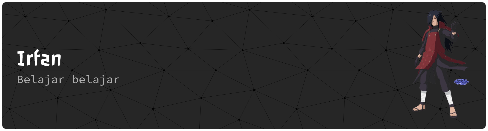

<h2 align="left">Halo Halo</h2>

Saya Irfan, seorang mahasiswa Teknik Informatika, Institut Teknologi Sumatera lagi belajar..

###

  
  
  
  
  
  
  
  
  
  
  
  
  
  
  
  
  

###

  
  

###

  

###

<picture>
  <source media="(prefers-color-scheme: dark)" srcset="https://raw.githubusercontent.com/irfanramadhan123/irfanramadhan123/output/pacman-contribution-graph-dark.svg">
  <source media="(prefers-color-scheme: light)" srcset="https://raw.githubusercontent.com/irfanramadhan123/irfanramadhan123/output/pacman-contribution-graph.svg">
  
</picture>

###